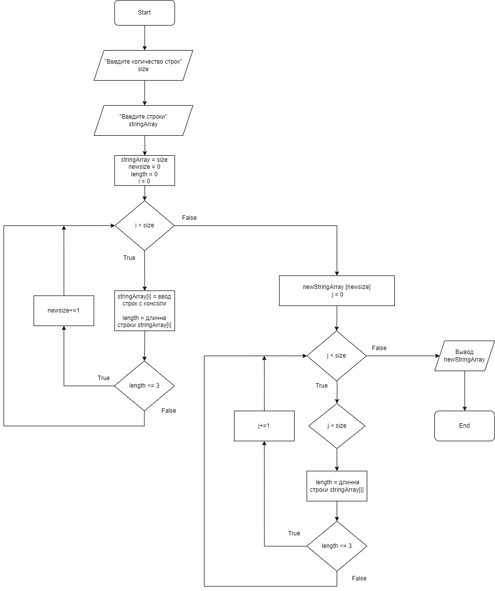

# __Решение итоговой контрольной работы по основному блоку__

## 1 Блок-схема

## 2 Описание

Данная программа принимает на вход *массив* строк, введённых пользователем. Производит проверку длинны строк каждого элемента. Создаёт __новый массив__ с элементами из первого массива, длина строк которых не превышает трёх символов.
После чего, выводит в консоль сформированный массив.

## 3 Алгоритм

1. Запрос на ввод числа количества элементов будущего массива
2. Ввод числа пользователем с клавиатуры
3. Запрос на ввод строк элементов массива
4. Создание массива заданного размера
5. Заполнение массива пользователем строками с клавиатуры
6. Подсчёт количества строк, длина которых не превышает трёх символов.
7. Создание нового массива с количеством элементов равным количеству подсчитанных строк.
8. Подсчёт строк из первого массива, длина которых не превышает трёх символов и заполнение ими нового массива
9. Вывод нового массива на экран пользователя